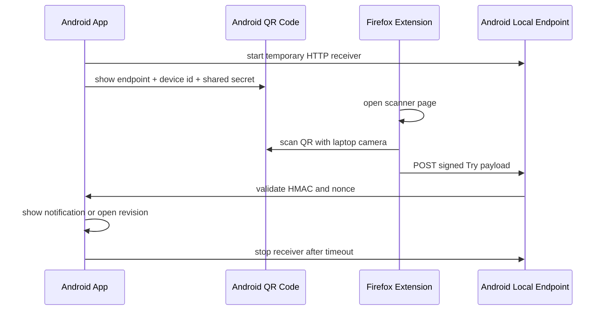

# TryFox Companion Extension

TryFox Companion Extension is a Firefox add-on that turns supported Treeherder job URLs into `tryfox://` deep links and renders them as QR codes directly in the browser popup. It can also send a supported Try revision or author query to the TryFox Android app over the local network after scanning a QR code shown by Android.

This project is based on the original FxQRL repository by xeonchen.

## What It Does

When you open the extension on a supported Treeherder page, it:

- Parses the current Treeherder URL
- Converts it into the matching `tryfox://jobs?...` deep link
- Generates a QR code for that deep link without any network request
- Shows an Android tab that can scan a QR code from the TryFox Android app and send the current Try payload over LAN

Supported cases currently include Treeherder `jobs` URLs using either:

- `revision`
- `author`

## Android LAN Send

The popup includes an `ANDROID` tab. The Android app starts a temporary local HTTP receiver and shows a QR code containing its endpoint and a shared secret. The extension opens a scanner page, uses the laptop camera to scan that QR code, requests permission for the Android LAN host, then saves the device for later sends. The extension can remember several Android devices, pings each local endpoint to show `Connected` or `Disconnected`, and sends the current Try payload with an HMAC-signed HTTP POST to every checked connected device.

The extension does not expose a local TCP, HTTP, or WebSocket server.



Expected Android QR payload:

```json
{
  "version": 1,
  "mode": "tryfox-lan-receive",
  "deviceId": "base64url-random-id",
  "deviceName": "Pixel 8",
  "endpoint": "http://192.168.1.42:8765/tryfox/v1/messages",
  "sharedSecret": "base64url-32-byte-secret",
  "expiresAt": 1760000000000
}
```

The extension stores the Android endpoint and shared secret in `browser.storage.local` for later sends. If the Android IP changes, scan the Android QR again to refresh the stored endpoint.

The Android receiver should also answer a lightweight `GET /tryfox/v1/messages` request, or at least return any HTTP response for that path, so the extension can detect whether the remembered device is currently reachable on the LAN. A network failure or timeout is shown as `Disconnected`.

The signed `POST /tryfox/v1/messages` JSON body can include an optional `title` field. The extension fills it from the Android tab `Label` field when provided, and serializes it as `null` when no label is set. The HMAC still uses the same headers and signing string format; `title` is covered because the signature is computed from the final raw JSON body.

## Install Locally In Firefox

To load the extension temporarily for development:

1. Open Firefox.
2. Go to `about:debugging`.
3. Click `This Firefox`.
4. Click `Load Temporary Add-on...`.
5. Select [manifest.json](/Users/titouanthibaud/Documents/Mozilla/Android/tryfox-qr/manifest.json).

Firefox will load the extension immediately. You will need to reload it from `about:debugging` after local code changes or after restarting Firefox.

## Build

The repo now includes a small build automation layer similar in spirit to the TryFox Android project: one local command for packaging, one test command, and GitHub Actions for CI and release artifacts.

Run the test suite with:

```bash
npm test
```

Build the extension package with:

```bash
npm run build
```

This creates:

- `dist/tryfox-companion-extension-<version>.xpi`
- `dist/tryfox-companion-extension.xpi`

## Install A Built Package

The generated `.xpi` is an unsigned development build.

That means:

- It can be loaded for development from `about:debugging`
- It cannot usually be installed permanently in standard release Firefox
- Release Firefox often reports unsigned add-ons as "corrupted"

If you want a permanently installable package, the extension needs to be signed. For local development, use the temporary loading flow from `about:debugging`.

## Manual Packaging

Firefox extensions are packaged as `.zip` or `.xpi` archives containing the extension files at the archive root.

From the project directory, you can create a package with:

```bash
zip -r tryfox-companion-extension.zip manifest.json src popup scanner settings icons LICENSE README.md
```

If you want an `.xpi` file instead, use:

```bash
zip -r tryfox-companion-extension.xpi manifest.json src popup scanner settings icons LICENSE README.md
```

The automated `npm run build` command uses the same packaging model and writes the archive into `dist/`.

## CI And Release Automation

The repository now includes GitHub Actions workflows that:

- Run the URL translation tests on pushes and pull requests
- Build the `.xpi` artifact in CI
- Publish the built unsigned extension artifact on version-tagged releases
